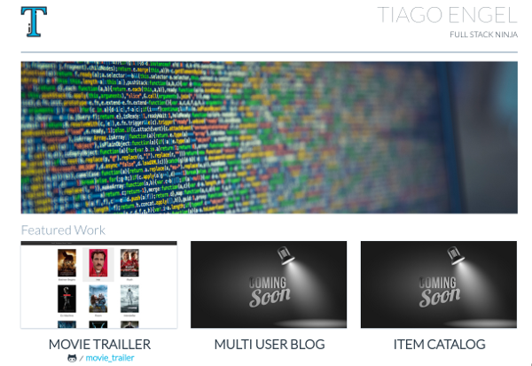

Udacity Portfolio
==

> Portfolio project to present my udacity projects



## Prerequisites
To execute this project you will need these:
- git
- nodejs >= 6
- imagemagick

## Usage

Clone the project and execute:

```shell
git clone https://github.com/tiagoengel/udacity_portfolio
cd udacity_portfolio
npm install
npm start
```

*Note: The command `npm install` will create all images the project needs,
if you want to recreate them afterwards just run `npm run images`*